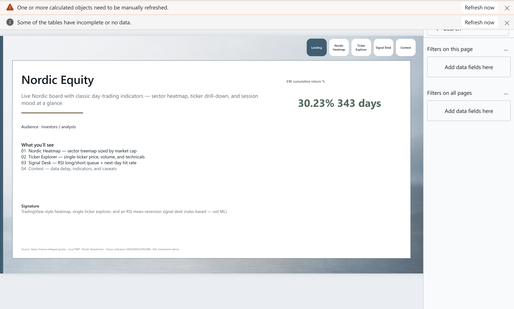
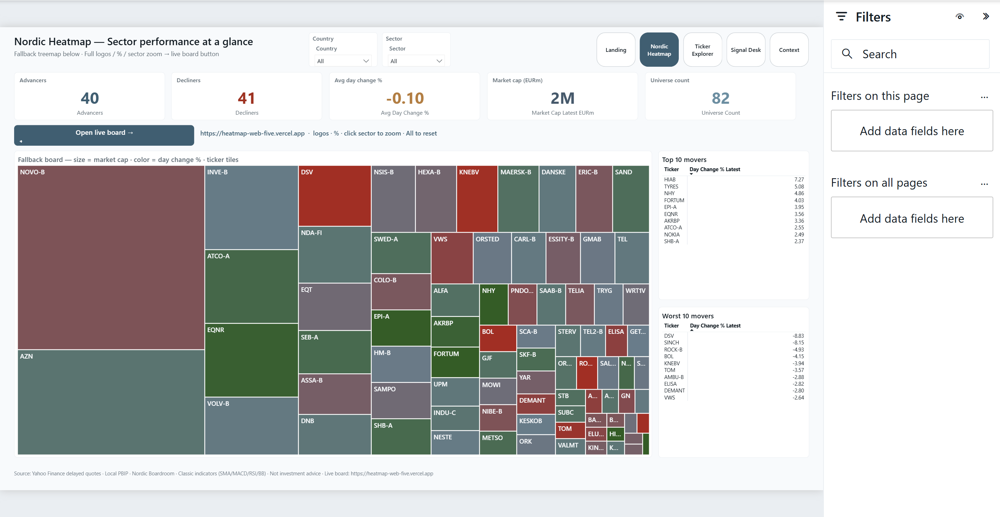
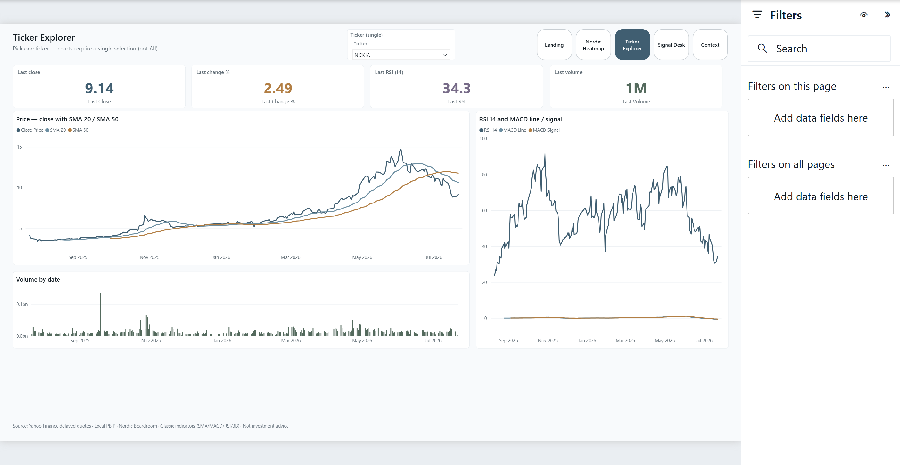
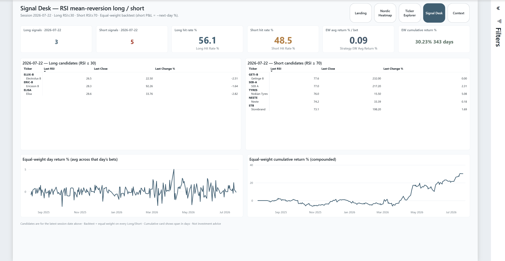
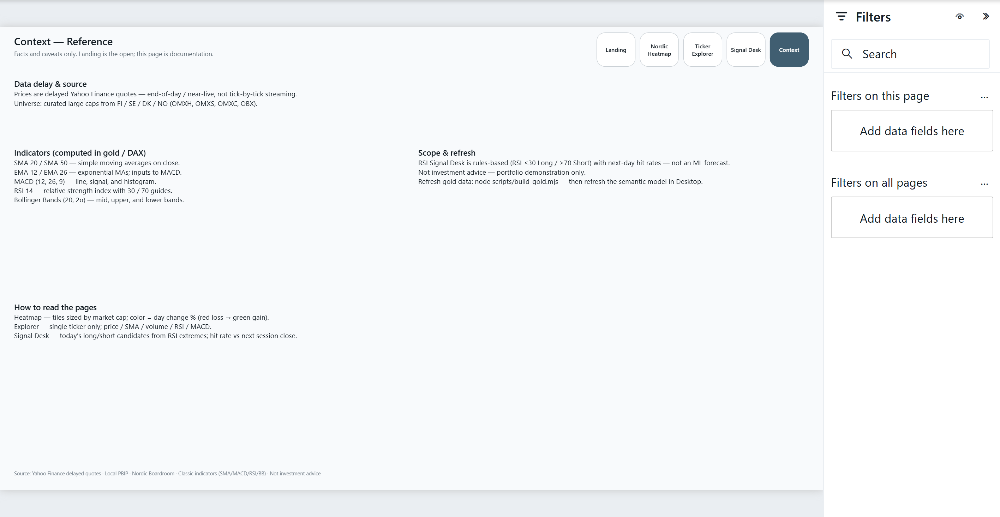

# Nordic Equity

Near-live Nordic large-cap board — TradingView-style sector heatmap, ticker explorer, and an RSI mean-reversion signal desk with classic day-trading indicators.

**Open:** [`NordicEquity.pbip`](NordicEquity.pbip)  
**Live board:** [heatmap-web-five.vercel.app](https://heatmap-web-five.vercel.app)

## Preview











## Pages

| Page | Role |
|------|------|
| **Landing** | Artistic cover · thesis · audience · page map · EW cumulative hero |
| **Nordic Heatmap** | Sector/company treemap · KPIs · open live board |
| **Ticker Explorer** | Single-ticker price, SMA, MACD, RSI, volume |
| **Signal Desk** | RSI long/short queue · hit rates · equal-weight backtest |
| **Context** | Delay, indicators, caveats (last visible) |

## What's in the folder

| Piece | Path |
|-------|------|
| PBIP entry | `NordicEquity.pbip` |
| Report (PBIR) | `NordicEquity.Report/` |
| Semantic model (TMDL) | `NordicEquity.SemanticModel/` |
| Gold CSVs | `data/gold/` |
| Spec | `_brief/report-spec.md` |
| Screenshots | `screenshots/` |
| Gold ETL | `scripts/build-gold.mjs` |
| Board snapshot | `scripts/snapshot-board.mjs` |
| Elevate layout | `scripts/elevate-nordic-equity-report.mjs` |
| Live web board | `heatmap-web/` |

## Live board (Vercel)

Native Power BI treemaps cannot show logos + % + sector chrome well. The TradingView-style board is a Vite app:

- App: [`heatmap-web/`](heatmap-web/)
- Prod: [https://heatmap-web-five.vercel.app](https://heatmap-web-five.vercel.app)
- Snapshot from gold: `node scripts/snapshot-board.mjs`
- Deploy: `cd heatmap-web && npx vercel --prod`

The Heatmap page has an **Open live board** button pointed at that URL.

## Data refresh

**Manual**

```powershell
node scripts/build-gold.mjs
node scripts/snapshot-board.mjs
# PBIP: open NordicEquity.pbip → Refresh in Desktop
# Web:  cd heatmap-web; npx vercel --prod
```

**Scheduled (GitHub Actions)**

Workflow [`.github/workflows/nordic-equity-gold-refresh.yml`](../.github/workflows/nordic-equity-gold-refresh.yml) runs weekdays at **17:00 UTC**:

1. Yahoo → `data/gold/*.csv`
2. Snapshot → `heatmap-web/public/board.json`
3. Commit + push if changed
4. Optional: fire `VERCEL_DEPLOY_HOOK` secret so the site redeploys

Add the hook in Vercel → Project → Settings → Git → Deploy Hooks, then store the URL as repo secret `VERCEL_DEPLOY_HOOK`.

Note: the **PBIP semantic model** still needs Desktop (or Fabric dataset) refresh separately — the Action updates files in git / the web board, not the open Desktop session.

## Open in Power BI Desktop

1. Clone this repo.
2. Open `01-finance/NordicEquity.pbip`.
3. If Desktop prompts for data location, point at `01-finance/data/gold` (forward slashes).
4. **Refresh** → **Save**.

## Build (PBIP)

```powershell
node scripts/build-gold.mjs
node scripts/scaffold-nordic-equity-pbip.mjs   # first time / model reset
node scripts/elevate-nordic-equity-report.mjs
powerbi-report-author validate NordicEquity.Report
```

## Audience & design

- Audience: investors / analysts / Nordic market watchers  
- Theme: Nordic Boardroom (`harbor-mist` Landing atmosphere)  
- Source: Yahoo Finance delayed quotes — see [`../DATASETS.md`](../DATASETS.md)  
- Not investment advice · delayed public quotes · no ML price forecast  

## Notes

- Indicators: SMA 20/50, EMA/MACD (12/26/9), RSI 14, Bollinger (20, 2σ), volume  
- Signal Desk: RSI mean-reversion long/short + equal-weight backtest  
- **No price forecast** in this report (separate future project)  
