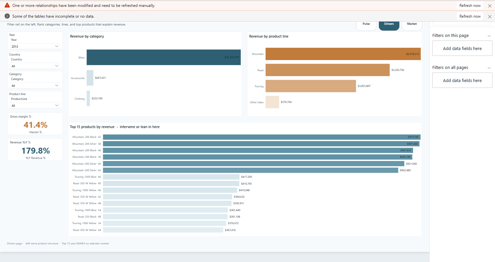
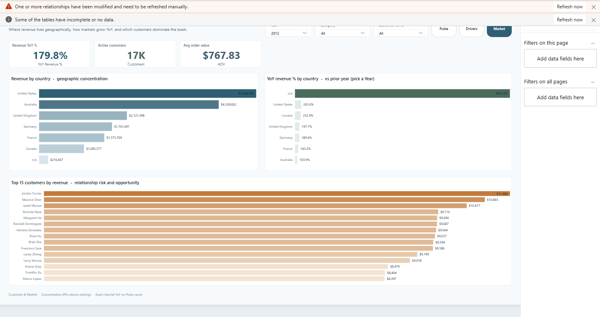

# Sales Executive — C-level portfolio report

Nordic Boardroom executive report for sales health: status in seconds, then self-serve into product drivers and customer/market concentration.

**Open:** [`SalesExecutive.pbip`](SalesExecutive.pbip)

## Preview






## Pages

| Page | Role |
|------|------|
| **Portfolio Pulse** | KPI strip (value + YoY ▲/▼) · monthly revenue trend · category mix |
| **Performance Drivers** | Filter rail · category / product line · top 15 products · margin & YoY callouts |
| **Customer & Market** | Country revenue & YoY · top 15 customers · concentration KPIs |

Default Year slicer: **2013** (full prior year for YoY).

## What's in the folder

| Piece | Path |
|-------|------|
| PBIP entry | `SalesExecutive.pbip` |
| Report (PBIR) | `SalesExecutive.Report/` |
| Semantic model (TMDL) | `SalesExecutive.SemanticModel/` |
| Gold star CSVs | `data/gold/` |
| Raw CRM/ERP CSVs | `data/raw/` |
| Spec / design contract | `_brief/report-spec.md` |
| Screenshots | `screenshots/` |
| Gold ETL | `scripts/build-gold.mjs` |
| Theme | `../_shared/themes/Nordic-Boardroom.json` |

## Open in Power BI Desktop

1. Clone this repo.
2. Open `03-sales-executive/SalesExecutive.pbip`.
3. Set the **GoldDataFolder** parameter (Transform data → Manage parameters) to your local path, for example:

   ```text
   C:/Users/<you>/.../powerbi-portfolio/03-sales-executive/data/gold
   ```

   Use forward slashes. Then **Close & Apply**.
4. If Desktop shows relationship/data banners, click **Refresh now**, then **Save**.

Optional (Store Desktop + Desktop Bridge):

```powershell
$env:PBI_DESKTOP_PATH = "C:\Program Files\WindowsApps\Microsoft.MicrosoftPowerBIDesktop_*\bin\PBIDesktop.exe"
```

## Model

Star schema: `FactSales` · `DimDate` · `DimCustomer` · `DimProduct`

- ~60k order lines, AdventureWorks-style sample from the KDNuggets warehouse CSVs (see [`../DATASETS.md`](../DATASETS.md))
- Continuous `DimDate` calendar 2009–2014 for prior-year YoY
- YoY measures compare selected calendar year(s) to the prior year

Rebuild gold from raw:

```bash
node scripts/build-gold.mjs
```

## Validate report definition

```bash
powerbi-report-author validate SalesExecutive.Report
```

## Audience & design

- Audience: C-level / senior leadership  
- Theme: Nordic Boardroom (mist `#F7FAFC`, teal `#2F5F73`, copper `#C17B3A`)  
- Signature: composite KPI treatment — headline value + YoY with ▲/▼ text  
