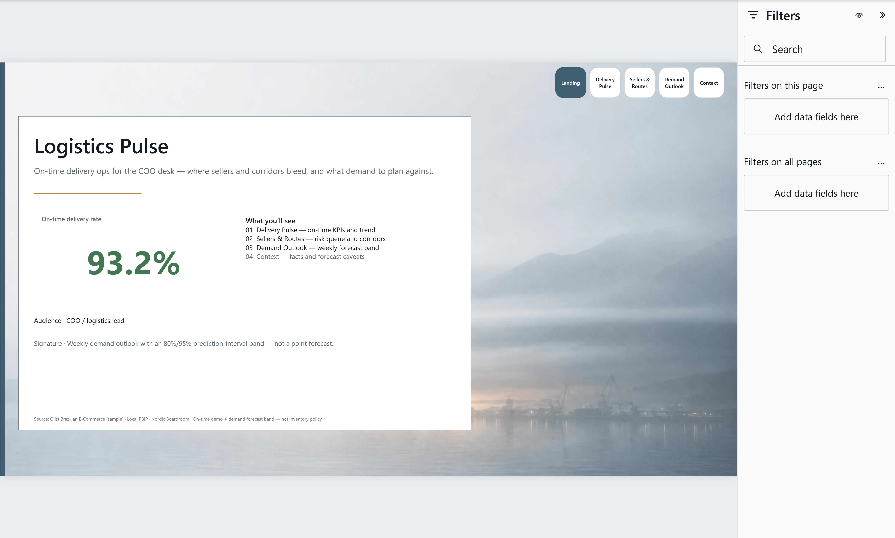
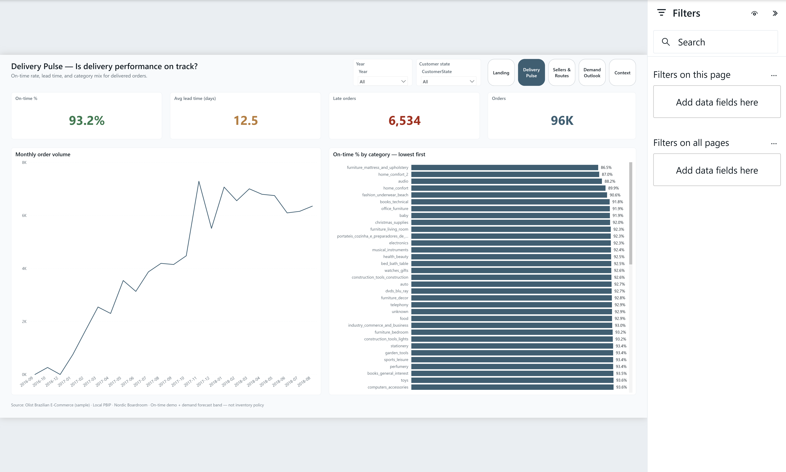
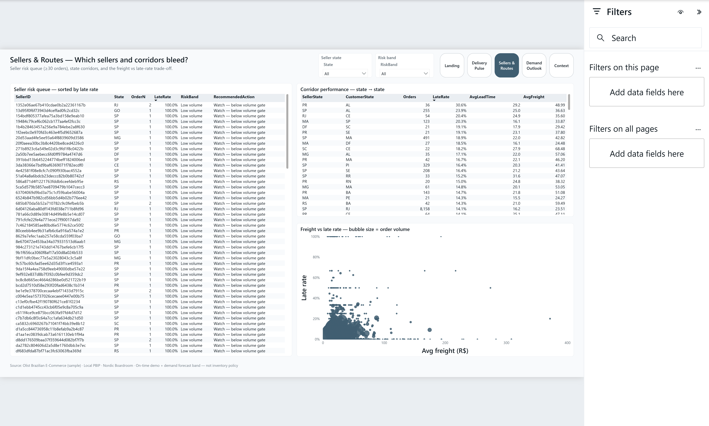
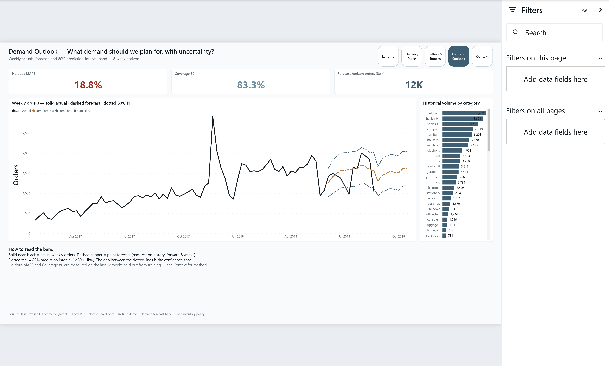
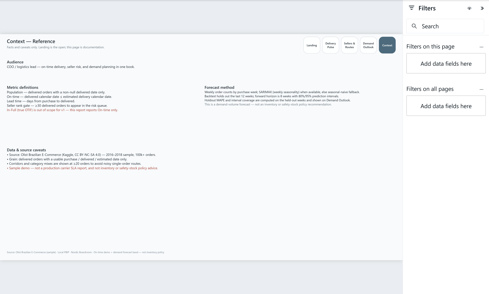

# 04 — Logistics Pulse

COO-style **on-time delivery + demand forecast** report: delivery pulse, seller risk, and a weekly demand outlook with prediction-interval bounds.

**Open:** [`LogisticsPulse.pbip`](LogisticsPulse.pbip)

## Preview











## Pages

| Page | Role |
|------|------|
| **Landing** | Poster · **On-time %** hero · page map · `harbor-mist` |
| **Delivery Pulse** | On-time · lead time · late volume · monthly trend · category mix |
| **Sellers & Routes** | Seller late-rate queue · corridor table · freight vs late scatter |
| **Demand Outlook** | Signature — actual / dashed forecast / dotted 80% PI bounds |
| **Context** | On-time definition · forecast caveats · sample disclaimer |

## Snapshot metrics (Olist sample)

| Signal | Value |
|--------|------:|
| Delivered orders | ~96k |
| On-time rate | 93.2% |
| Avg lead time | 12.5 days |
| Sellers ranked (≥30 orders) | 621 |
| Forecast holdout MAPE | 18.8% (SARIMAX) |
| PI coverage 80% / 95% | 83% / 100% |

## What's in the folder

| Piece | Path |
|-------|------|
| PBIP entry | `LogisticsPulse.pbip` |
| Report (PBIR) | `LogisticsPulse.Report/` |
| Semantic model (TMDL) | `LogisticsPulse.SemanticModel/` |
| Gold CSVs | `data/gold/` |
| Raw notes | `data/raw/SOURCE.md` |
| Spec | `_brief/report-spec.md` |
| Screenshots | `screenshots/` |
| Pipeline | `scripts/build-gold.py`, `forecast-demand.py`, `scaffold-logistics-pbip.mjs`, `elevate-logistics-report.mjs` |

## Dataset

**[Olist Brazilian E-Commerce](https://www.kaggle.com/datasets/olistbr/brazilian-ecommerce)** (CC BY-NC-SA 4.0) — marketplace orders 2016–2018.

- KPI branded as **On-time delivery %** (delivered date ≤ estimated). True In-Full OTIF is out of v1.
- Forecast is a portfolio demo (SARIMAX weekly order counts) — not inventory policy advice.
- No Icon Map hero (Bank already owns that signature).

## Open in Power BI Desktop

1. Clone this repo.
2. Open `04-supply-chain/LogisticsPulse.pbip`.
3. Set **GoldDataFolder** (Transform data → Manage parameters) if needed:

   ```text
   C:/Users/<you>/.../powerbi-portfolio/04-supply-chain/data/gold
   ```

   Use forward slashes. Then **Close & Apply** → **Refresh** → **Save**.

## Rebuild gold + report

```powershell
cd 04-supply-chain
py -3.12 -m venv .venv
.\.venv\Scripts\pip install -r requirements.txt
# Download Olist CSVs into data/raw/ (see data/raw/SOURCE.md)
.\.venv\Scripts\python scripts\build-gold.py
.\.venv\Scripts\python scripts\forecast-demand.py
node scripts\scaffold-logistics-pbip.mjs
node scripts\elevate-logistics-report.mjs
powerbi-report-author validate .\LogisticsPulse.Report
```

## Theme

Nordic Boardroom · Landing atmosphere `harbor-mist`
