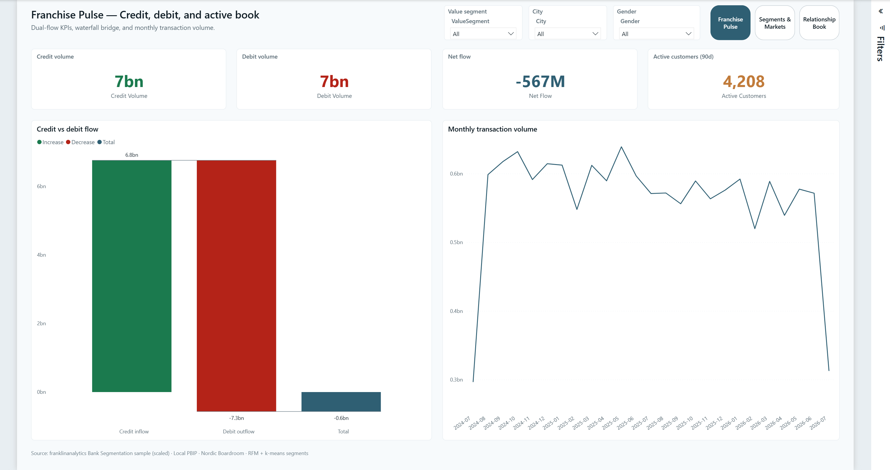
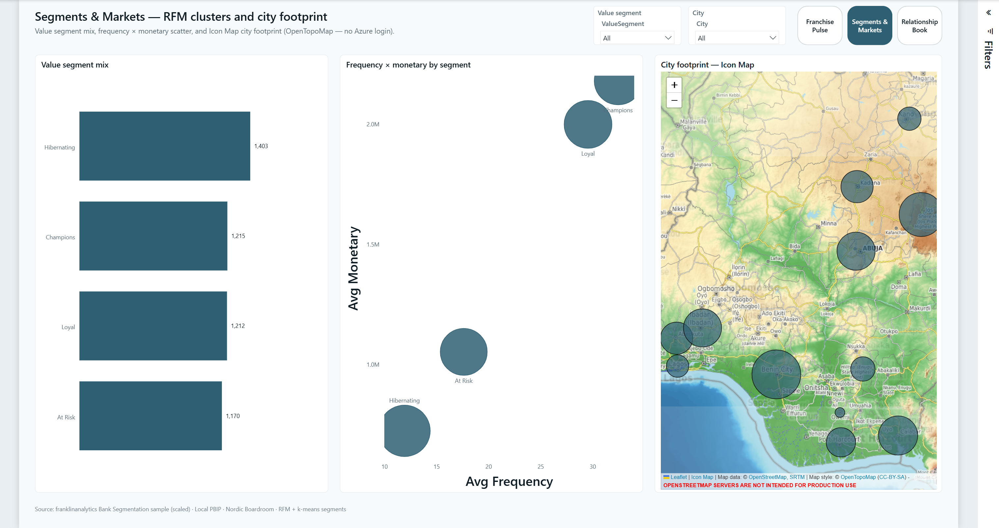
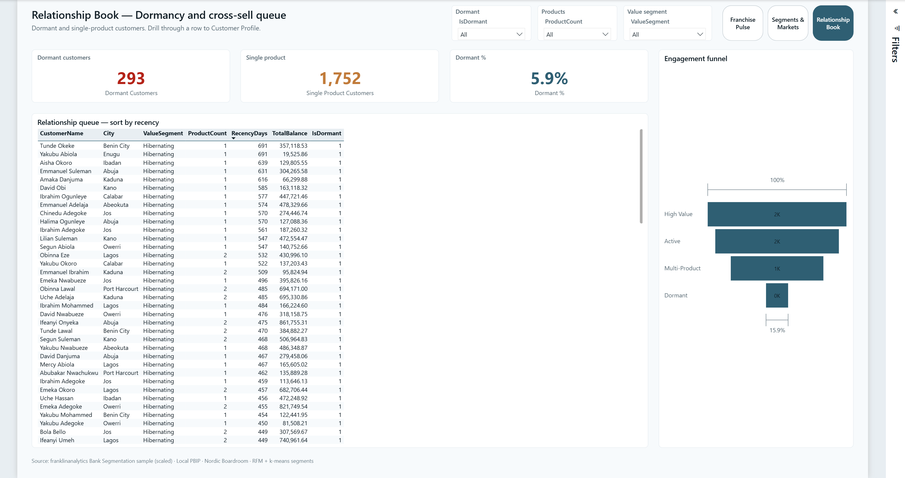

# 05 — Bank Value & Engagement

Nordic Boardroom retail-bank report: dual-flow KPIs, RFM/k-means segments, geocoded city footprint, and a dormancy / cross-sell relationship book with drillthrough.

**Open:** [`BankValue.pbip`](BankValue.pbip)

## Preview







## Pages

| Page | Role |
|------|------|
| **Franchise Pulse** | Credit / debit / net flow · waterfall bridge · monthly volume |
| **Segments & Markets** | Value segment mix · F×M scatter · Icon Map (OpenTopoMap) |
| **Relationship Book** | Dormant + single-product queue · engagement funnel · drillthrough |
| **Customer Profile** | Hidden drillthrough — accounts + recent transactions |

## What's in the folder

| Piece | Path |
|-------|------|
| PBIP entry | `BankValue.pbip` |
| Report (PBIR) | `BankValue.Report/` |
| Semantic model (TMDL) | `BankValue.SemanticModel/` |
| Gold CSVs | `data/gold/` |
| Upstream SQL sample | `data/raw/` |
| Spec | `_brief/report-spec.md` |
| Screenshots | `screenshots/` |
| Gold seed | `scripts/seed-bank-gold.mjs` |
| RFM + k-means | `scripts/score-rfm.py` |
| Scaffold / elevate | `scripts/scaffold-bank-pbip.mjs`, `elevate-bank-report.mjs` |
| Python deps | `requirements.txt` |

## Open in Power BI Desktop

1. Clone this repo.
2. Open `05-bank-segmentation/BankValue.pbip`.
3. Set the **GoldDataFolder** parameter (Transform data → Manage parameters) to your local path, for example:

   ```text
   C:/Users/<you>/.../powerbi-portfolio/05-bank-segmentation/data/gold
   ```

   Use forward slashes. Then **Close & Apply**.
4. If Desktop shows relationship/data banners, click **Refresh now**, then **Save**.

> City footprint uses **Icon Map** (Leaflet + OpenTopoMap tiles) — real map, no Azure Maps sign-in. Needs internet for tiles. Allow the custom visual if Desktop prompts.

## Rebuild gold + segments

```bash
pip install -r requirements.txt
node scripts/seed-bank-gold.mjs
python scripts/score-rfm.py
```

Scaled sample: ~5k customers · ~8k accounts · ~113k transactions. ValueSegment labels from RFM quintiles + k-means (k=4).

## Validate report definition

```bash
powerbi-report-author validate BankValue.Report
```

## Audience & design

- Audience: retail-bank CRO / relationship lead  
- Theme: Nordic Boardroom (same chrome as Sales + Churn: page nav pills, mist canvas, footer source line)  
- Source: [franklinanalytics/Bank-Segmentation-Analysis](https://github.com/franklinanalytics/Bank-Segmentation-Analysis) (KDNuggets #4) — see [`../DATASETS.md`](../DATASETS.md)
