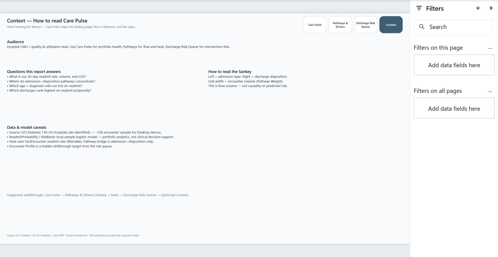

# 06 – Care Pulse (Hospital Readmission)

30-day readmission propensity, admission→disposition pathways, and a discharge risk queue for hospital quality storytelling.

**Status:** Built locally — PBIP + Nordic Boardroom; Desktop Bridge verified with screenshots  
**Audience:** Hospital CMO / quality & utilization lead  
**Theme:** Nordic Boardroom (`_shared/themes/Nordic-Boardroom-a1b2c3d4.json`)

**Open:** [`CarePulse.pbip`](CarePulse.pbip)

## Preview




## Pages

| Page | Role |
|------|------|
| **Landing** | Artistic cover · thesis · audience · page map (opens first) |
| **Care Pulse** | KPI strip · monthly volume · readmit by diagnosis |
| **Pathways & Drivers** | Sankey admission→disposition · age × diagnosis heat · discharge-group bars |
| **Discharge Risk Queue** | Encounters ranked by `ReadmitProbability` · risk / age / discharge slicers |
| **Context** | Facts-only reference · Sankey how-to · data/model caveats (last visible) |

## Open in Desktop

1. Open `06-healthcare-analytics/CarePulse.pbip`.
2. Set the **GoldDataFolder** parameter to your local `data/gold` path (forward slashes), then **Close & Apply**.
3. If banners say data needs refresh: **Refresh**, then **Save**.

Store Desktop path (if Bridge can't find exe):

```powershell
$env:PBI_DESKTOP_PATH = "C:\Program Files\WindowsApps\Microsoft.MicrosoftPowerBIDesktop_*\bin\PBIDesktop.exe"
```

## What's included

| Piece | Path |
|-------|------|
| Gold star CSVs | `data/gold/` (~35k encounters) |
| Raw UCI sample | `data/raw/uci/` |
| Semantic model | `CarePulse.SemanticModel/` |
| Report | `CarePulse.Report/` — Care Pulse · Pathways & Drivers · Discharge Risk Queue · Context (+ hidden Encounter Profile) |
| Spec | `_brief/report-spec.md` |

## Pipeline

```bash
# Python: C:\Users\kater\AppData\Local\Programs\Python\Python312\python.exe
python scripts/build-gold.py
python scripts/score-readmit.py
node scripts/scaffold-healthcare-pbip.mjs
node scripts/elevate-healthcare-report.mjs
```

## Advanced analytics

- **30-day readmission propensity** (logistic, class-weighted) → `ReadmitProbability`, `RiskBand`, `RiskRank`
- **Microsoft Sankey** (embedded CustomVisual) — admission → disposition pathway weights
- **Matrix heatmap** — age band × diagnosis group readmit rate
- Ranked **Discharge Risk Queue** + Encounter Profile drillthrough

> Sankey packaged from [microsoft/powerbi-visuals-sankey](https://github.com/microsoft/powerbi-visuals-sankey) 3.4.5.0 (MIT), embedded under `CarePulse.Report/CustomVisuals/` like Icon Map on Bank.

## Dataset

Prefer **UCI Diabetes 130-US Hospitals** (true `readmitted` label) over KDNuggets Kaggle billing samples without outcomes. See [`DATASETS.md`](../DATASETS.md).
