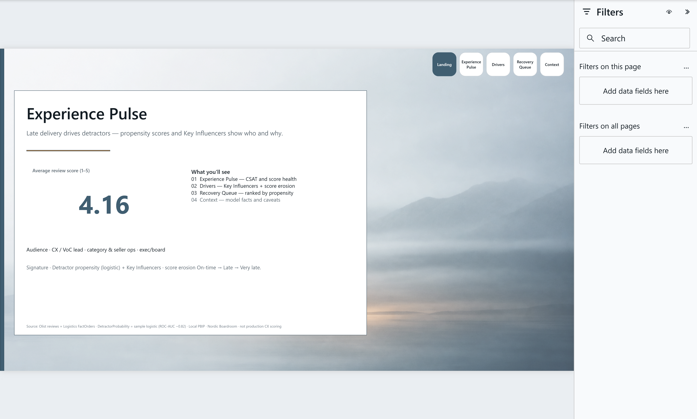
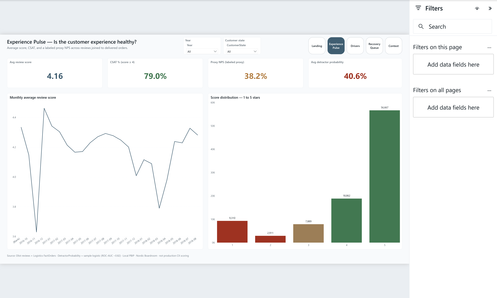
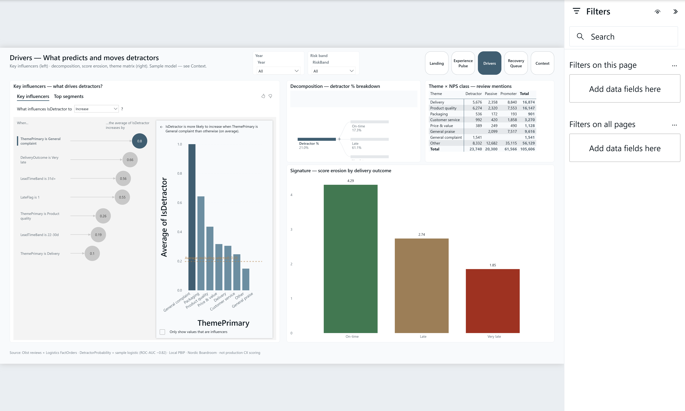
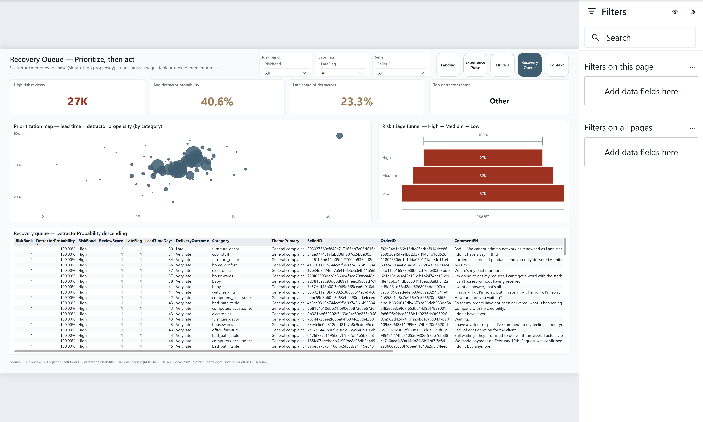
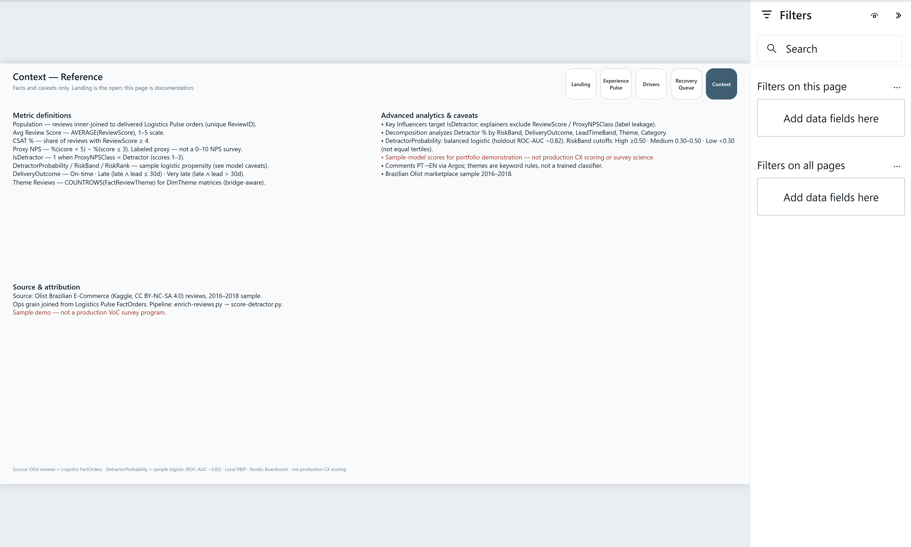

# 08 — Experience Pulse

CX / VoC **review-score** report with **detractor propensity** (logistic), Key Influencers, score erosion by delivery, and a probability-ranked recovery queue.

**Open:** [`ExperiencePulse.pbip`](ExperiencePulse.pbip)

**Status:** Featured — PBIP + gold + ML scores + screenshots

## Pages

| Page | Role |
|------|------|
| **Landing** | Poster · **Avg Review Score** hero · page map · `linen-mist` |
| **Experience Pulse** | Avg score · CSAT % · proxy NPS · avg detractor probability · trend |
| **Drivers** | Tall Key Influencers · decomposition + theme matrix · score erosion |
| **Recovery Queue** | Prioritization scatter · risk funnel · ranked by `DetractorProbability` |
| **Context** | Metric + model caveats (sample logistic, not production CX) |











## Snapshot metrics (Olist sample)

| Signal | Value |
|--------|------:|
| Reviews (unique ReviewID) | ~96k |
| Avg review score | 4.16 |
| On-time / Late / Very late avg score | ~4.29 / ~2.74 / ~1.85 |
| Detractor holdout ROC-AUC | ~0.82 |
| Free-text comments | ~41% |

## What's in the folder

| Piece | Path |
|-------|------|
| PBIP entry | `ExperiencePulse.pbip` |
| Report (PBIR) | `ExperiencePulse.Report/` |
| Semantic model (TMDL) | `ExperiencePulse.SemanticModel/` |
| Gold CSVs | `data/gold/` |
| Raw notes | `data/raw/SOURCE.md` |
| Spec | `_brief/report-spec.md` |
| Screenshots | `screenshots/` |
| Pipeline | `scripts/enrich-reviews.py`, `score-detractor.py`, `scaffold-experience-pbip.mjs`, `elevate-experience-report.mjs` |

## Dataset

**[Olist Brazilian E-Commerce](https://www.kaggle.com/datasets/olistbr/brazilian-ecommerce)** reviews joined to Logistics Pulse `FactOrders`.

- KPI branded as **Avg Review Score** / **CSAT %** (score ≥ 4). **Proxy NPS** (5 vs ≤3) is labeled on Context — not a true 0–10 survey.
- Comment English is Argos PT→EN machine translation; themes are keyword rules.
- Complementary to Logistics Pulse (ops) — not a duplicate.

## Open in Power BI Desktop

1. Clone this repo.
2. Open `08-customer-experience/ExperiencePulse.pbip`.
3. Set **GoldDataFolder** (Transform data → Manage parameters) if needed:

   ```text
   C:/Users/<you>/.../PowerBI/08-customer-experience/data/gold
   ```

   Use forward slashes. Then **Close & Apply** → **Refresh** → **Save**.

## Rebuild gold + report

```powershell
cd 08-customer-experience
py -3.12 -m venv .venv
.\.venv\Scripts\pip install -r requirements.txt
# Needs 04-supply-chain gold + Olist reviews (see data/raw/SOURCE.md)
.\.venv\Scripts\python scripts/enrich-reviews.py
.\.venv\Scripts\python scripts/score-detractor.py
node scripts/scaffold-experience-pbip.mjs   # first time / model reset
node scripts/elevate-experience-report.mjs
powerbi-report-author validate ExperiencePulse.Report
powerbi-desktop status
powerbi-desktop reload --pid <pid> --wait-seconds 120
```

After gold/TMDL changes, also **Refresh** the model in Desktop — `reload` alone updates report definition, not imported data.

## Audience & design

- Audience: CX / VoC lead (primary) · seller/category ops · board skim  
- Theme: Nordic Boardroom · Landing atmosphere `linen-mist`  
- Signature: score erosion by delivery outcome  
