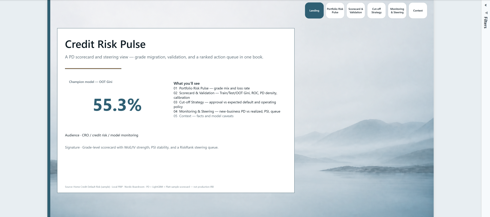
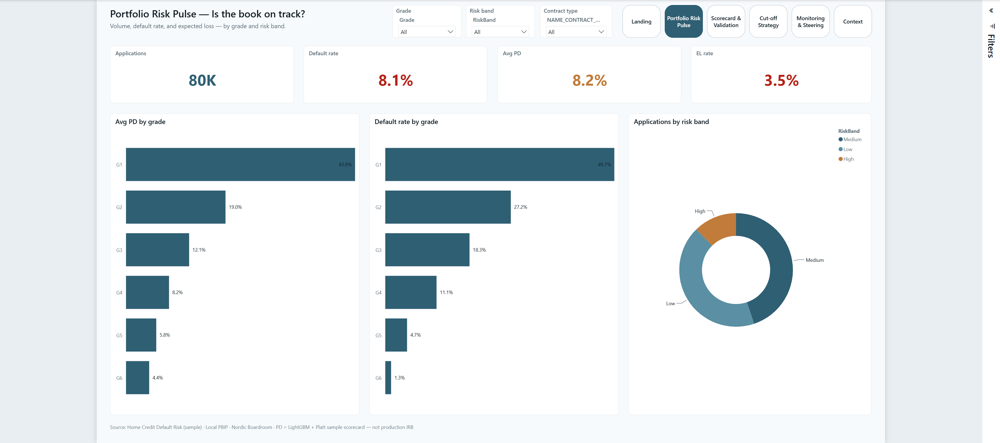
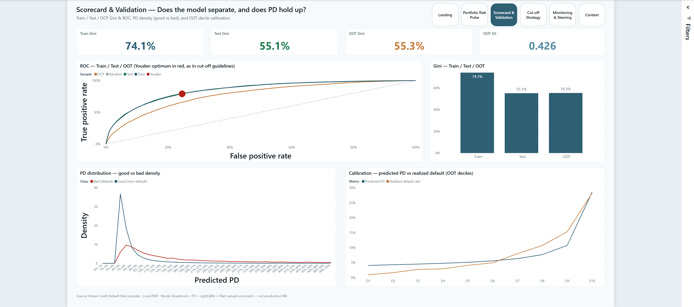
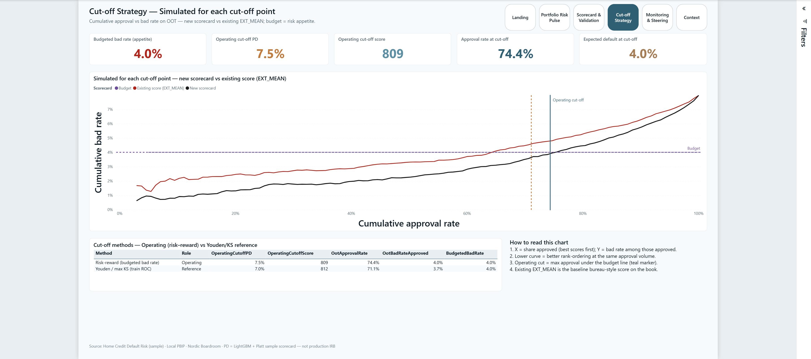
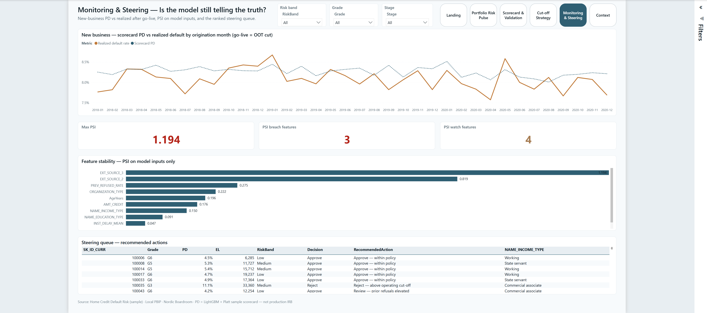
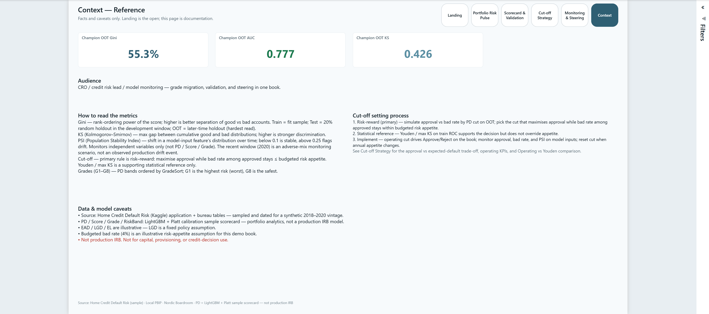

# 11 — Credit Risk Pulse

Nordic Boardroom **PD scorecard + cut-off strategy + monitoring + steering** report for consumer credit — domain flagship.

**Open:** [`CreditRisk.pbip`](CreditRisk.pbip)

## Preview













## Pages

| Page | Role |
|------|------|
| **Landing** | Poster cover · thesis · **OOT Gini** hero · page map |
| **Portfolio Risk Pulse** | Applications · default rate · Avg PD · EL rate · grade / risk band |
| **Scorecard & Validation** | Train/Test/OOT Gini · ROC · PD density · OOT calibration |
| **Cut-off Strategy** | Acceptance frontier (new vs EXT_MEAN) · budget · operating / Youden policy |
| **Monitoring & Steering** | New-business PD vs realized · PSI on IVs · steering queue |
| **Context** | Home Credit attribution · sample-model caveats · champion metrics |
| **Application Profile** | Hidden drillthrough |

## What's in the folder

| Piece | Path |
|-------|------|
| PBIP entry | `CreditRisk.pbip` |
| Report (PBIR) | `CreditRisk.Report/` |
| Semantic model (TMDL) | `CreditRisk.SemanticModel/` |
| Gold CSVs | `data/gold/` |
| Raw source notes | `data/raw/SOURCE.md` |
| Spec | `_brief/report-spec.md` |
| Screenshots | `screenshots/` |
| Download / gold / score | `scripts/download-homecredit.py`, `build-gold.py`, `score-pd.py` |
| Scaffold / elevate | `scripts/scaffold-credit-pbip.mjs`, `elevate-credit-report.mjs` |
| Python deps | `requirements.txt` |

## Open in Power BI Desktop

1. Clone this repo.
2. Open `11-credit-risk/CreditRisk.pbip`.
3. Set the **GoldDataFolder** parameter (Transform data → Manage parameters) to your local path, for example:

   ```text
   C:/Users/<you>/.../powerbi-portfolio/11-credit-risk/data/gold
   ```

   Use forward slashes. Then **Close & Apply**.
4. If Desktop shows relationship/data banners, click **Refresh now**, then **Save**.

## Rebuild gold + scorecard

```powershell
cd 11-credit-risk
py -3.12 -m venv .venv
.\.venv\Scripts\python.exe -m pip install -r requirements.txt
.\.venv\Scripts\python.exe scripts\download-homecredit.py   # HF mirror (or Kaggle)
.\.venv\Scripts\python.exe scripts\build-gold.py
.\.venv\Scripts\python.exe scripts\score-pd.py
node scripts\scaffold-credit-pbip.mjs
node scripts\elevate-credit-report.mjs
powerbi-report-author validate CreditRisk.pbip
```

Desktop sample: **80k** apps (full book **307,511**). Champion: **LightGBM + Platt**.

## Model metrics (sample scorecard)

| Metric | Value |
|--------|------:|
| Full N / Desktop sample | 307,511 / 80,000 |
| Default rate | 8.07% |
| Train / Test / OOT Gini | 74.1% / 55.1% / 55.3% |
| OOT KS | 0.426 |
| Calib mean PD vs realized (OOT) | 8.15% vs 7.94% |
| Budgeted bad-rate appetite | 4.0% |
| Operating cut-off (risk–reward) | PD ≤ 7.5% |
| OOT approval / bad rate @ cut-off | 74.4% / 4.0% |
| Youden / max KS (reference) | PD ≤ ~7.2% |
| Champion | LightGBM + Platt calibration |

> Retail Home Credit **time-OOT Gini** with public FE typically lands mid-50s; competition stacks push toward ~60. This build maximizes practical discrimination without fabricating holdout metrics.

## Validate report definition

```bash
powerbi-report-author validate CreditRisk.pbip
```

## Audience & design

- Audience: CRO / credit risk / model monitoring  
- Theme: Nordic Boardroom (mist canvas, page nav pills, footer source line)  
- Signature: master-scale grade strip + acceptance-frontier cut-off chart  
- Source: [Home Credit Default Risk](https://www.kaggle.com/c/home-credit-default-risk) — see [`../DATASETS.md`](../DATASETS.md)

## Spec

[`_brief/report-spec.md`](_brief/report-spec.md) — **APPROVED**

## Notes

- Sample model only — not production IRB / IFRS 9  
- Complements `05-bank-segmentation` (RFM engagement), not a duplicate  
- LGD fixed at 0.45 for EL storytelling  
- Existing-score baseline on the cut-off chart is Home Credit `EXT_MEAN` (bureau-style external sources)
