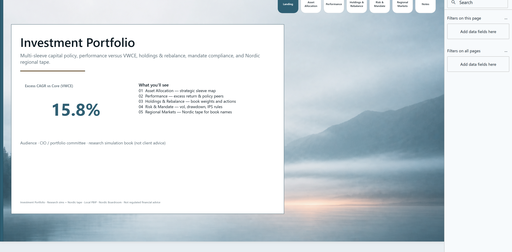
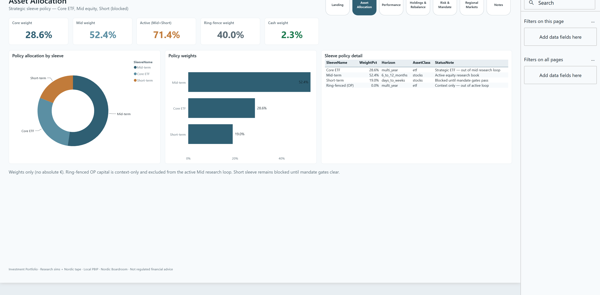
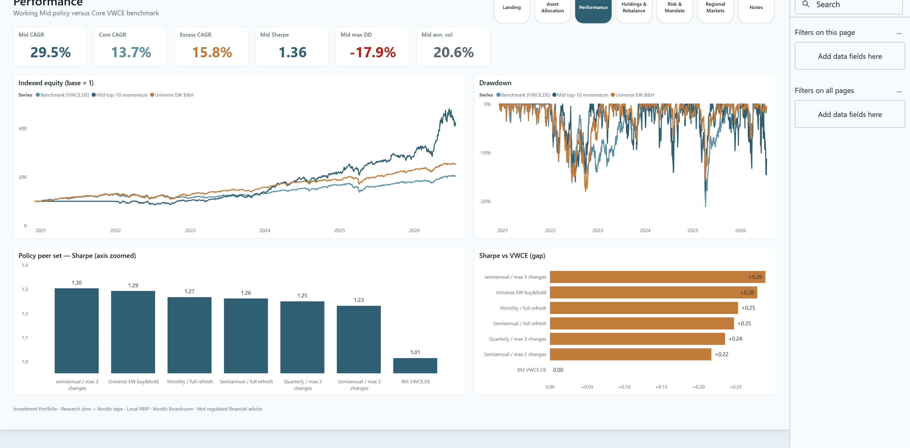
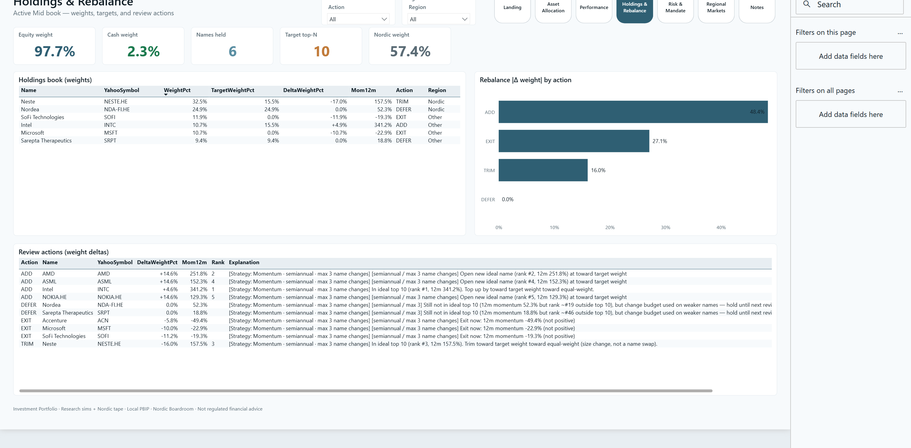
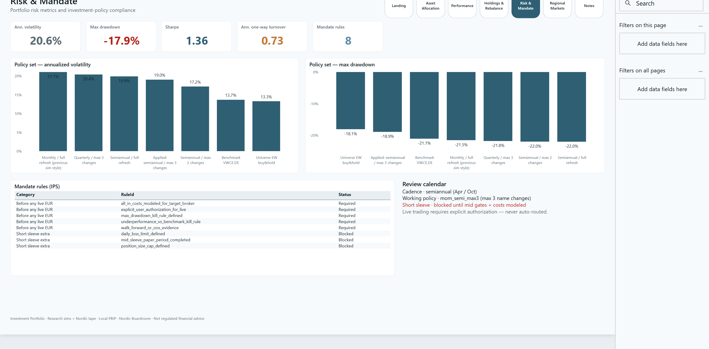
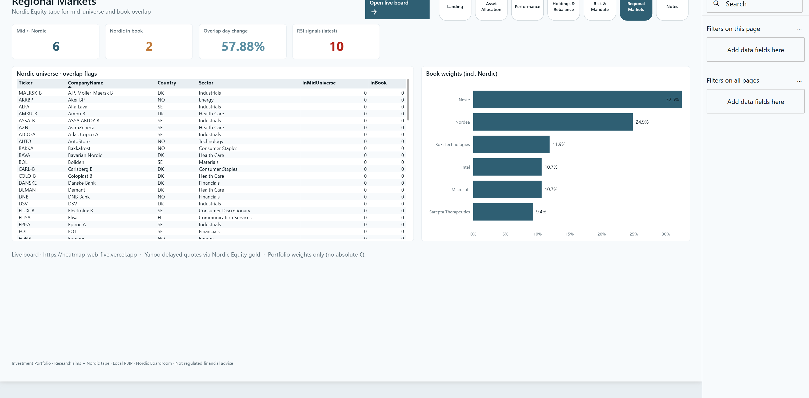
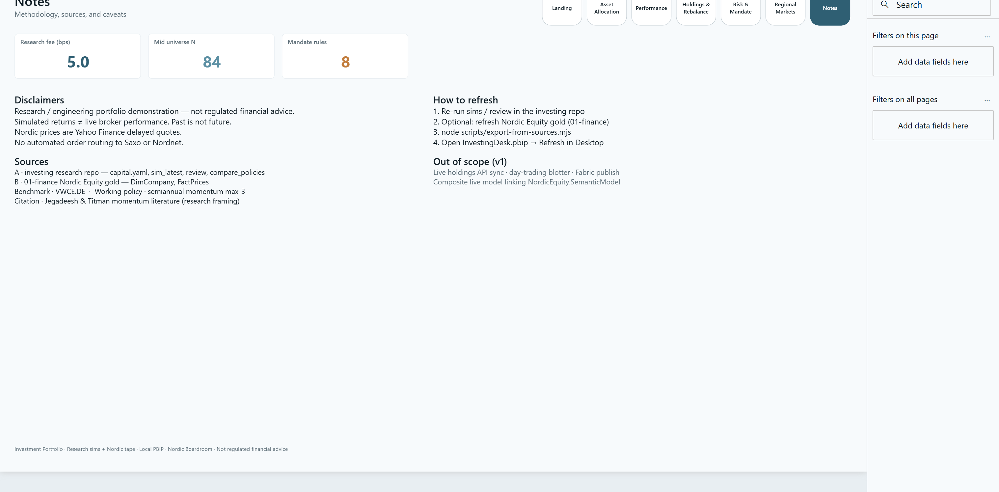

# 12 — Investment Portfolio

CIO-style **multi-sleeve investment portfolio** report: strategic allocation, excess return vs VWCE, holdings & rebalance, mandate compliance, Nordic regional tape.

**Open:** [`InvestingDesk.pbip`](InvestingDesk.pbip)

## Preview















## Pages

| Page | Role |
|------|------|
| **Landing** | CIO poster · **Excess CAGR vs Core** hero · page map |
| **Asset Allocation** | Sleeve weights · ring-fence context (weights only) |
| **Performance** | Indexed equity · drawdown · Sharpe peers + gap vs VWCE |
| **Holdings & Rebalance** | Book weights · EXIT/ENTER/TRIM/DEFER |
| **Risk & Mandate** | Vol / MDD · IPS rules · review calendar |
| **Regional Markets** | Nordic overlap · [live board](https://heatmap-web-five.vercel.app) CTA |
| **Notes** | Methodology · not advice · refresh path |

## What's in the folder

| Piece | Path |
|-------|------|
| PBIP entry | `InvestingDesk.pbip` |
| Report (PBIR) | `InvestingDesk.Report/` |
| Semantic model (TMDL) | `InvestingDesk.SemanticModel/` |
| Gold CSVs | `data/gold/` |
| Dual-source notes | `data/raw/SOURCE.md` |
| Spec | `_brief/report-spec.md` |
| Screenshots | `screenshots/` |
| Export / scaffold / elevate | `scripts/export-from-sources.mjs`, `scaffold-investing-desk-pbip.mjs`, `elevate-investing-desk-report.mjs` |

## Dual sources

| Source | Role |
|--------|------|
| Sibling [`investing`](../../investing) | Capital, sims, review actions, policy compare, mandate gates |
| [`01-finance`](../01-finance/) Nordic Equity gold | DimCompany / FactPrices → Regional Markets |

## Open in Power BI Desktop

1. Clone this repo.
2. Open `12-investing-desk/InvestingDesk.pbip`.
3. Set **GoldDataFolder** (Transform data → Manage parameters) if needed, for example:

   ```text
   C:/Users/<you>/.../powerbi-portfolio/12-investing-desk/data/gold
   ```

   Use forward slashes. Then **Close & Apply** → **Refresh** → **Save**.

## Rebuild gold + report

```powershell
cd 12-investing-desk
# Optional: refresh sims/review in the investing repo first
node scripts/export-from-sources.mjs
node scripts/scaffold-investing-desk-pbip.mjs   # first time / model reset
node scripts/elevate-investing-desk-report.mjs
powerbi-report-author validate InvestingDesk.Report
```

Optional env: `INVESTING_ROOT`, `HEATMAP_WEB_URL`.

## Snapshot metrics (research sim)

| Metric | Value |
|--------|------:|
| Excess CAGR (Mid − Core VWCE) | ~15.8% |
| Mid CAGR / Sharpe / Max DD | ~29.5% / ~1.36 / ~-18% |
| Core CAGR / Sharpe | ~13.7% / ~1.01 |
| Working policy | `mom_semi_max3` (semiannual · max 3 name changes) |
| Book framing | Weights only (no absolute € on visuals) |

> Research / engineering demonstration — **not regulated financial advice**. Sims ≠ live broker performance.

## Validate report definition

```bash
powerbi-report-author validate InvestingDesk.Report
```

## Audience & design

- Audience: CIO / portfolio committee  
- Theme: Nordic Boardroom (`alpine-mist` Landing)  
- Complements Nordic Equity (market board) with capital policy + research evidence  
