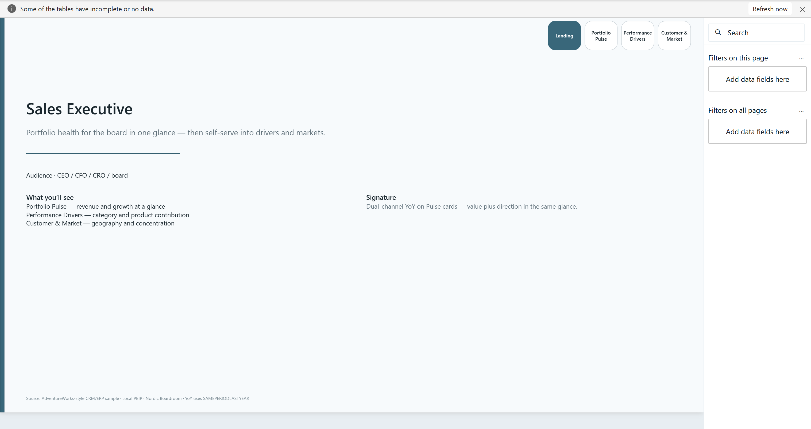
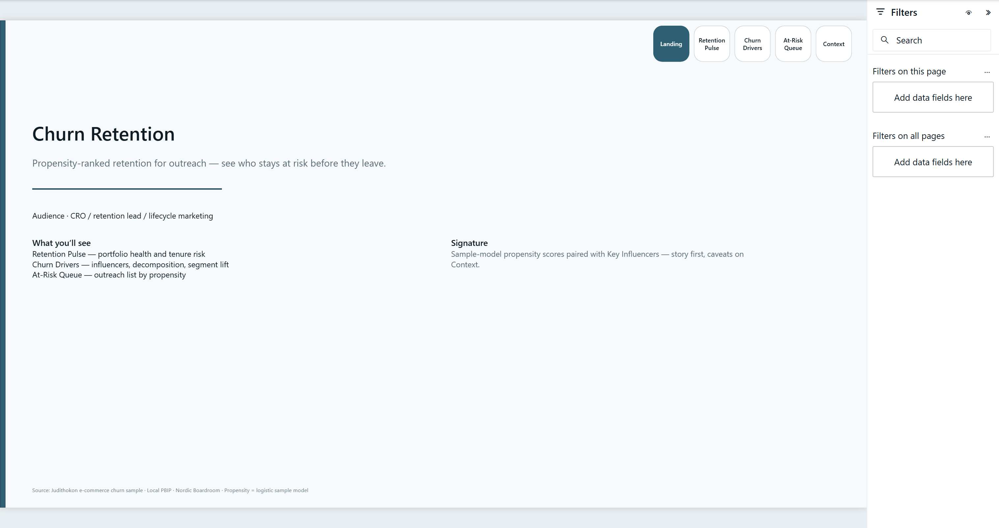
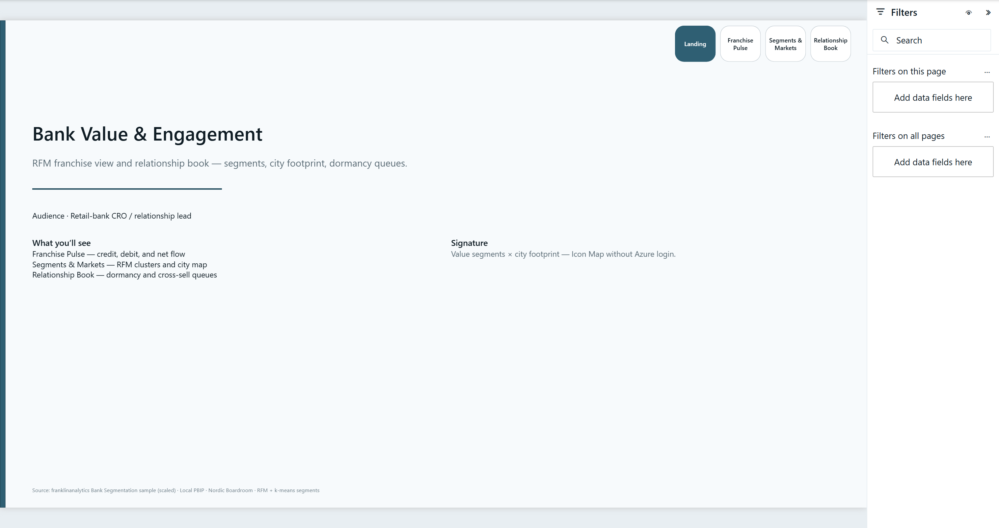
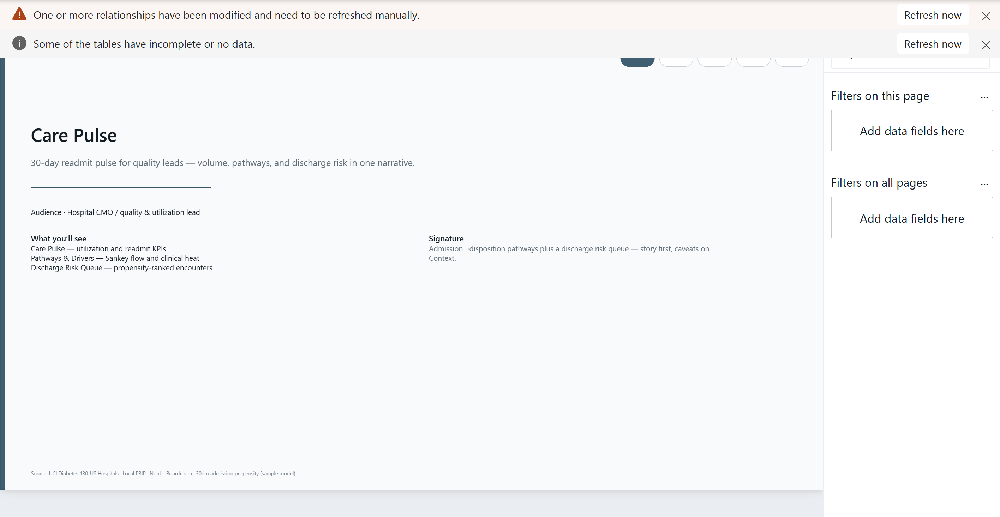
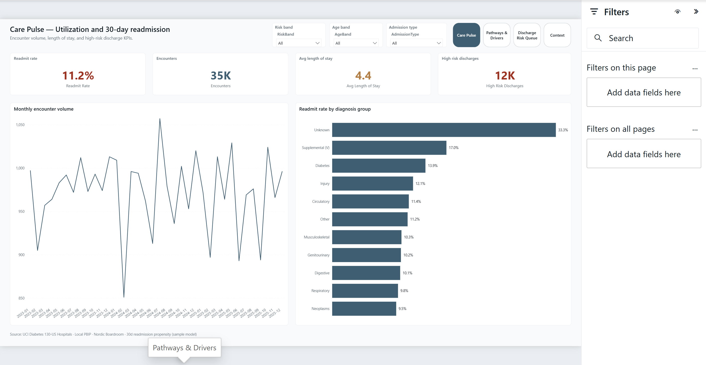
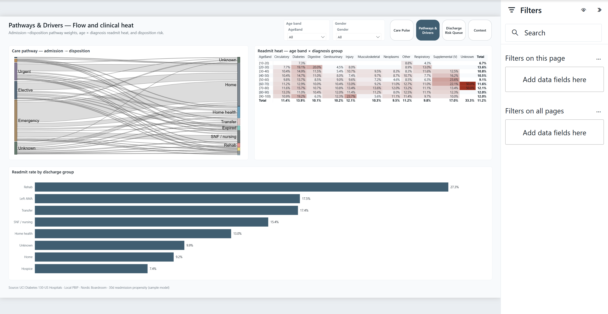
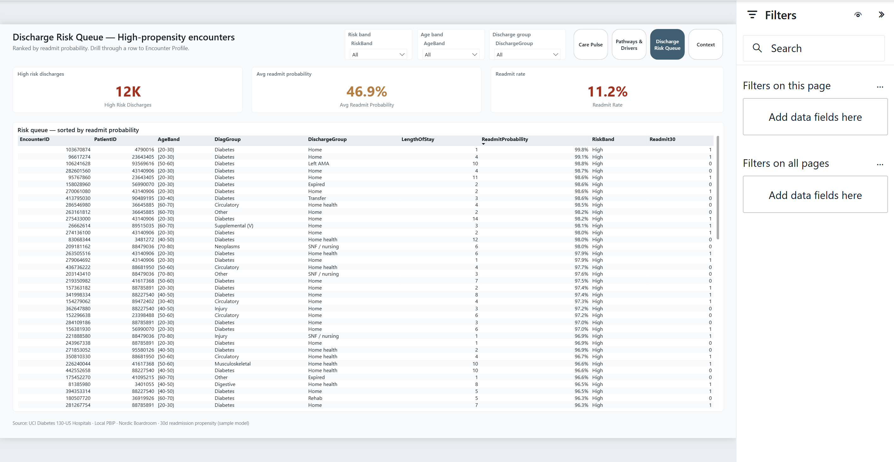

# Power BI Portfolio

Nordic-inspired Power BI reports and dashboards — clean executive storytelling you can open as PBIP projects.

## Featured projects

### Sales Executive

C-level sales portfolio report built as a local **PBIP** (report + semantic model + gold data).

| | |
|---|---|
| Audience | CEO / CFO / CRO / board |
| Theme | Nordic Boardroom |
| Pages | Landing · Portfolio Pulse · Performance Drivers · Customer & Market |
| Open | [`03-sales-executive/SalesExecutive.pbip`](03-sales-executive/SalesExecutive.pbip) |

Details: [`03-sales-executive/README.md`](03-sales-executive/README.md)

### Churn Retention (Advanced)

ML propensity scoring + Key Influencers + at-risk queue for e-commerce retention.

| | |
|---|---|
| Audience | CRO / retention lead |
| Theme | Nordic Boardroom |
| Pages | Landing · Retention Pulse · Churn Drivers · At-Risk Queue · Context |
| Open | [`02-ecommerce-churn/ChurnRetention.pbip`](02-ecommerce-churn/ChurnRetention.pbip) |

Details: [`02-ecommerce-churn/README.md`](02-ecommerce-churn/README.md)

### Bank Value & Engagement

RFM + k-means segments, dual-flow waterfall, city map, and a dormancy / cross-sell relationship book.

| | |
|---|---|
| Audience | Retail-bank CRO / relationship lead |
| Theme | Nordic Boardroom |
| Pages | Landing · Franchise Pulse · Segments & Markets · Relationship Book |
| Open | [`05-bank-segmentation/BankValue.pbip`](05-bank-segmentation/BankValue.pbip) |

Details: [`05-bank-segmentation/README.md`](05-bank-segmentation/README.md)

### Care Pulse (Hospital Readmission)

30-day readmission propensity, admission→disposition pathway ribbon, and clinical age × diagnosis heat — hospital CMO / quality storytelling.

| | |
|---|---|
| Audience | Hospital CMO / quality lead |
| Theme | Nordic Boardroom |
| Pages | Landing · Care Pulse · Pathways & Drivers · Discharge Risk Queue · Context |
| Open | [`06-healthcare-analytics/CarePulse.pbip`](06-healthcare-analytics/CarePulse.pbip) |

Details: [`06-healthcare-analytics/README.md`](06-healthcare-analytics/README.md)

## Projects

Data lined up from [5 Real-World SQL Projects (KDNuggets)](https://www.kdnuggets.com/5-real-world-sql-projects-to-build-your-data-portfolio) — see [`DATASETS.md`](DATASETS.md).

| Folder | Topic | Status |
|--------|-------|--------|
| [`03-sales-executive`](03-sales-executive/) | Sales executive (KDNuggets #3) | **Featured** — PBIP + screenshots |
| [`02-ecommerce-churn`](02-ecommerce-churn/) | E-commerce churn (KDNuggets #1) | **Featured** — PBIP + ML propensity |
| [`05-bank-segmentation`](05-bank-segmentation/) | Bank segmentation (KDNuggets #4) | **Featured** — RFM + map + drillthrough |
| [`01-finance`](01-finance/) | Nordic stock treemap | Brief / theme WIP |
| [`06-healthcare-analytics`](06-healthcare-analytics/) | Healthcare readmission | **Featured** — UCI + propensity + pathways |

## Design system

Shared theme: [`_shared/themes/Nordic-Boardroom.json`](_shared/themes/Nordic-Boardroom.json)  
Review notes: [`_shared/themes/THEME-REVIEW.md`](_shared/themes/THEME-REVIEW.md)

- Cool mist surfaces, fjord teal primary, copper categorical accent  
- Segoe UI, sparse chrome, dual-channel YoY (arrow + %)  
- FHD canvas, KPI-strip landing page

## About

- Location: Nordics (Helsinki, FI)  
- Focus: analytics, Power BI, executive dashboard design  
- Style: minimal, decision-ready in seconds  

Built iteratively — one finished project at a time.
