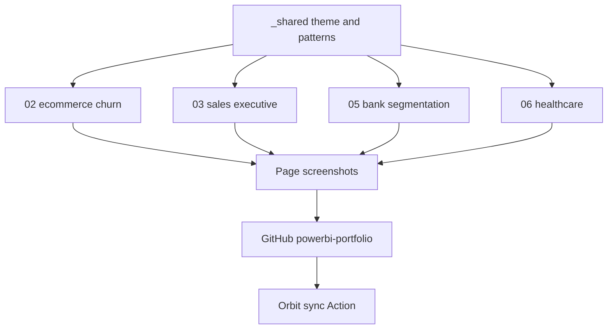

# Nordic Boardroom stack

Shared design system and build path across churn, sales, bank, and healthcare reports.

```mermaid
flowchart TB
  Shared[_shared theme and patterns] --> Churn[02 ecommerce churn]
  Shared --> Sales[03 sales executive]
  Shared --> Bank[05 bank segmentation]
  Shared --> Care[06 healthcare]
  Churn --> Export[Page screenshots]
  Sales --> Export
  Bank --> Export
  Care --> Export
  Export --> GH[GitHub powerbi-portfolio]
  GH --> OrbitSync[Orbit sync Action]
```
