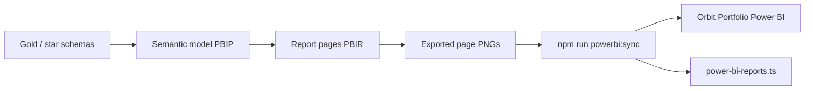

# Power BI portfolio pipeline

How reports move from local PBIP work to the Orbit Portfolio showcase.

```mermaid
flowchart LR
  Gold[Gold / star schemas] --> Model[Semantic model PBIP]
  Model --> Pages[Report pages PBIR]
  Pages --> Shots[Exported page PNGs]
  Shots --> Sync[npm run powerbi:sync]
  Sync --> Orbit[Orbit Portfolio Power BI]
  Sync --> Meta[power-bi-reports.ts]
```
