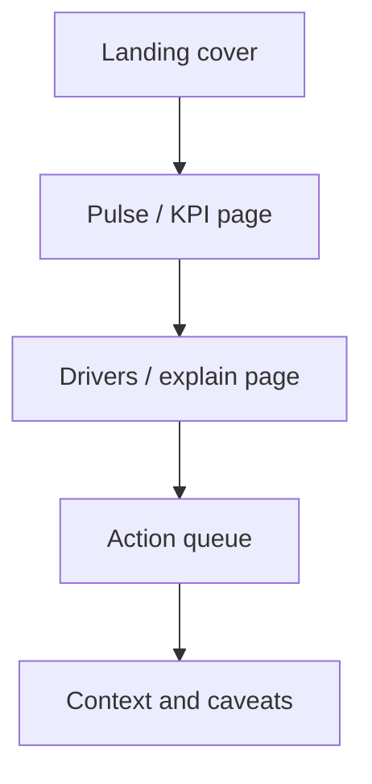

# Report page contract

Each portfolio report follows the same reader path so a hiring manager can scan without guessing where to look.

```mermaid
flowchart TB
  Landing[Landing cover] --> Pulse[Pulse / KPI page]
  Pulse --> Drivers[Drivers / explain page]
  Drivers --> Queue[Action queue]
  Queue --> Context[Context and caveats]
```
